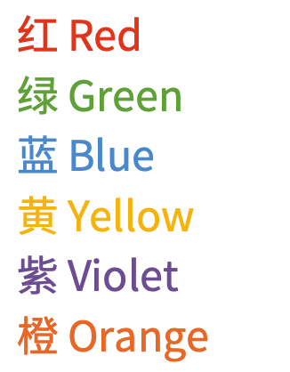

# ⚙ OneNote Hot Keys for Font Operation
## Some Macros by using Keyboard Maestro

# ⚙ 操作OneNote for Mac的字体的快捷键
## 使用Keyboard Maestro制作的宏

# ⚠️ 前排提示
 - 我自己默认字体大小为14，而后的字体大小设置也以此为基础，你可以自行修改为自己喜欢的大小
 - 需要保持菜单栏展开状态，且选中的是“开始”
 - 因为是模拟鼠标在窗口的相对左上角位置，需要在大窗口模式（能显示完整的菜单按钮的样子），否则可能点不到。
 - 会复制内容（所以会顶掉最近一个复制内容）。
 - 相邻操作需要稍微顿一下，根据电脑性能自行感知，例如1秒，否则会出现前后操作重叠而出错。

# ℹ️ 具体指南

## 1. shift + cmd + </>
每次增大/减小8个大小单位

没有选中文本时自动选中整行内容

没有上下限判定，不过OneNote会自动提示

## 2. opt + cmd + 1/2/3
这里覆盖了原有的快捷键

字体大小变为22/30/38

## 3. opt + cmd + ~
字体大小变为18

## 4. ctrl + cmd + 1/2/3/4/5/6
修改字体颜色，对应RGBYVO（红绿蓝黄紫橙）

